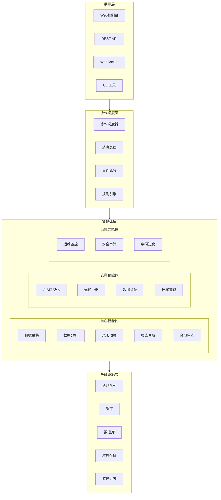
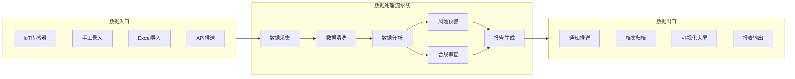

# 昆仑框架架构图设计文档

本文档提供昆仑框架的架构图描述，可使用 Draw.io、PlantUML 或 Mermaid 等工具绘制。

---

## 一、项目整体架构图

### 1.1 三层架构总览

```
┌─────────────────────────────────────────────────────────────────────────┐
│                           展示层 (Presentation Layer)                    │
│  ┌─────────────┐  ┌─────────────┐  ┌─────────────┐  ┌─────────────┐     │
│  │  Web控制台   │  │  REST API   │  │  WebSocket  │  │   CLI工具   │     │
│  │  Dashboard  │  │  Gateway    │  │   实时推送   │  │   命令行    │     │
│  └─────────────┘  └─────────────┘  └─────────────┘  └─────────────┘     │
└─────────────────────────────────────────────────────────────────────────┘
                                    │
                                    ▼
┌─────────────────────────────────────────────────────────────────────────┐
│                          协作调度层 (Coordination Layer)                  │
│  ┌─────────────────────────────────────────────────────────────────┐   │
│  │                      协作调度器 (Coordinator)                      │   │
│  │  ┌──────────┐ ┌──────────┐ ┌──────────┐ ┌──────────┐            │   │
│  │  │ 任务分发  │ │ 流程编排  │ │ 状态同步  │ │ 负载均衡  │            │   │
│  │  └──────────┘ └──────────┘ └──────────┘ └──────────┘            │   │
│  └─────────────────────────────────────────────────────────────────┘   │
│                                    │                                     │
│  ┌───────────────────┐  ┌───────────────────┐  ┌───────────────────┐   │
│  │   消息总线        │  │   事件总线        │  │   规则引擎        │   │
│  │   Message Bus    │  │   Event Bus      │  │   Rule Engine    │   │
│  └───────────────────┘  └───────────────────┘  └───────────────────┘   │
└─────────────────────────────────────────────────────────────────────────┘
                                    │
                                    ▼
┌─────────────────────────────────────────────────────────────────────────┐
│                          智能体层 (Agent Layer)                         │
│                                                                         │
│  ┌─────────────────────────────────────────────────────────────────┐   │
│  │                    十三神智能体 (13 Divine Agents)                 │   │
│  │                                                                 │   │
│  │  ┌─────────┐ ┌─────────┐ ┌─────────┐ ┌─────────┐ ┌─────────┐    │   │
│  │  │数据采集 │ │数据分析 │ │风险预警 │ │报告生成 │ │合规审查 │    │   │
│  │  └─────────┘ └─────────┘ └─────────┘ └─────────┘ └─────────┘    │   │
│  │                                                                 │   │
│  │  ┌─────────┐ ┌─────────┐ ┌─────────┐ ┌─────────┐ ┌─────────┐    │   │
│  │  │GIS可视  │ │通知中枢 │ │数据清洗 │ │档案管理 │ │安全审计 │    │   │
│  │  └─────────┘ └─────────┘ └─────────┘ └─────────┘ └─────────┘    │   │
│  │                                                                 │   │
│  │  ┌─────────┐ ┌─────────┐ ┌─────────┐                          │   │
│  │  │运维监控 │ │学习进化 │ │协作调度 │                          │   │
│  │  └─────────┘ └─────────┘ └─────────┘                          │   │
│  └─────────────────────────────────────────────────────────────────┘   │
│                                                                         │
│  ┌─────────────────────────────────────────────────────────────────┐   │
│  │                    Actor运行时 (Actor Runtime)                    │   │
│  │  ┌──────────┐ ┌──────────┐ ┌──────────┐ ┌──────────┐          │   │
│  │  │  邮箱    │ │  监督树  │ │ 路由表   │ │ 序列化   │          │   │
│  │  │ Mailbox  │ │Supervisor│ │ Router   │ │ Serializer│          │   │
│  │  └──────────┘ └──────────┘ └──────────┘ └──────────┘          │   │
│  └─────────────────────────────────────────────────────────────────┘   │
└─────────────────────────────────────────────────────────────────────────┘
                                    │
                                    ▼
┌─────────────────────────────────────────────────────────────────────────┐
│                          基础设施层 (Infrastructure Layer)               │
│                                                                         │
│  ┌──────────┐ ┌──────────┐ ┌──────────┐ ┌──────────┐ ┌──────────┐     │
│  │  消息队列 │ │  缓存    │ │  数据库   │ │ 对象存储 │ │ 监控日志 │     │
│  │ RabbitMQ │ │  Redis   │ │PostgreSQL│ │   OSS   │ │Prometheus│     │
│  └──────────┘ └──────────┘ └──────────┘ └──────────┘ └──────────┘     │
│                                                                         │
│  ┌──────────┐ ┌──────────┐ ┌──────────┐ ┌──────────┐                  │
│  │ K8s集群 │ │ Docker   │ │  网关    │ │ 证书管理  │                  │
│  └──────────┘ └──────────┘ └──────────┘ └──────────┘                  │
└─────────────────────────────────────────────────────────────────────────┘
```

---

## 二、十三神智能体关系图

```
                              ┌───────────────┐
                              │  协作调度器   │
                              │  Coordinator  │
                              └───────┬───────┘
                                      │
        ┌─────────────────────────────┼─────────────────────────────┐
        │                             │                             │
        ▼                             ▼                             ▼
┌───────────────┐           ┌───────────────┐           ┌───────────────┐
│  数据采集 Agent│◄─────────│  数据清洗 Agent│           │  数据分析 Agent│
│ DataCollector │           │ DataCleaner   │           │   Analyzer    │
└───────┬───────┘           └───────────────┘           └───────┬───────┘
        │                                                         │
        │                           ┌───────────────────────────┘
        │                           │
        ▼                           ▼
┌───────────────┐           ┌───────────────┐           ┌───────────────┐
│ 风险预警 Agent│◄──────────│ 合规审查 Agent│◄──────────│ 报告生成 Agent│
│ RiskWarning   │           │ Compliance    │           │   Reporter    │
└───────┬───────┘           └───────────────┘           └───────┬───────┘
        │                                                         │
        │                           ┌───────────────────────────┘
        │                           │
        ▼                           ▼
┌───────────────┐           ┌───────────────┐           ┌───────────────┐
│ GIS可视化 Agent│          │ 通知中枢 Agent │           │ 档案管理 Agent │
│    GIS        │           │  Notifier     │           │   Archiver    │
└───────────────┘           └───────────────┘           └───────────────┘
                                                                          
                              ┌───────────────┐
                              │ 运维监控 Agent │
                              │  Monitor      │
                              └───────┬───────┘
                                      │
                              ┌───────┴───────┐
                              │  安全审计 Agent│
                              │  Security     │
                              └───────┬───────┘
                                      │
                              ┌───────┴───────┐
                              │ 学习进化 Agent │
                              │  Evolution    │
                              └───────────────┘

═══════════════════════════════════════════════════════════════════════════
                              图例 / Legend
═══════════════════════════════════════════════════════════════════════════
  
  ───►  数据流向     ─ ─ ─ ►  条件触发     ┌────┐  辅助依赖
  ◄──►  双向通信     ▒▒▒▒▒▒▒▒▒▒  核心数据流
  
  ┌────┐  智能体节点   ●────●  监督关系
  │    │              

═══════════════════════════════════════════════════════════════════════════
```

### 智能体职责矩阵

| 智能体 | 输入 | 处理逻辑 | 输出 | 协作对象 |
|--------|------|----------|------|----------|
| **数据采集** | 传感器/API | 数据验证、格式转换 | 标准数据 | 数据清洗 |
| **数据清洗** | 原始数据 | 异常检测、缺失值处理 | 干净数据 | 分析/可视化 |
| **数据分析** | 清洗后数据 | 统计建模、趋势分析 | 分析结果 | 预警/报告 |
| **风险预警** | 分析结果 | 阈值检测、趋势预测 | 告警事件 | 通知中枢 |
| **合规审查** | 业务数据 | 法规比对、合规判定 | 审查意见 | 报告生成 |
| **报告生成** | 综合数据 | 模板填充、格式优化 | 正式报告 | 档案管理 |
| **GIS可视化** | 空间数据 | 地图渲染、图层叠加 | 可视化结果 | Web控制台 |
| **通知中枢** | 告警/事件 | 渠道选择、内容组装 | 通知推送 | 用户 |
| **档案管理** | 所有产出 | 索引构建、存储管理 | 归档记录 | 全局 |
| **运维监控** | 系统指标 | 健康检查、容量预警 | 运维事件 | 安全审计 |
| **安全审计** | 操作日志 | 异常检测、权限校验 | 审计报告 | 运维监控 |
| **学习进化** | 执行记录 | 案例学习、模型更新 | 进化策略 | 所有智能体 |
| **协作调度** | 全局状态 | 任务分发、流程编排 | 执行计划 | 所有智能体 |

---

## 三、数据流向图

```
┌─────────────────────────────────────────────────────────────────────────┐
│                              数据入口层                                   │
│                                                                         │
│   ┌─────────┐  ┌─────────┐  ┌─────────┐  ┌─────────┐  ┌─────────┐     │
│   │ IoT设备 │  │  手工录入 │  │  Excel  │  │  API   │  │  爬虫   │     │
│   │ 传感器  │  │  人工填报 │  │  导入   │  │  推送   │  │  采集   │     │
│   └────┬────┘  └────┬────┘  └────┬────┘  └────┬────┘  └────┬────┘     │
└────────┼───────────┼───────────┼───────────┼───────────┼───────────┘
         │           │           │           │           │
         └───────────┴───────────┴─────┬─────┴───────────┘
                                       │
                                       ▼
┌─────────────────────────────────────────────────────────────────────────┐
│                           消息总线 (Kafka/RabbitMQ)                      │
│                                                                         │
│   主题: raw-data, cleaned-data, analyzed-data, alerts, reports          │
│                                                                         │
└─────────────────────────────────────────────────────────────────────────┘
                                       │
         ┌─────────────────────────────┼─────────────────────────────┐
         │                             │                             │
         ▼                             ▼                             ▼
┌─────────────────┐         ┌─────────────────┐         ┌─────────────────┐
│    数据采集     │         │    数据清洗     │         │    数据分析     │
│  DataCollector  │────────►│   DataCleaner   │────────►│    Analyzer    │
└─────────────────┘         └─────────────────┘         └────────┬────────┘
                                                                  │
                                                                  ▼
┌─────────────────┐         ┌─────────────────┐         ┌─────────────────┐
│    风险预警     │◄────────│    合规审查     │◄────────│   分析结果池    │
│  RiskWarning   │         │   Compliance    │         │   Result Pool  │
└────────┬────────┘         └─────────────────┘         └─────────────────┘
         │                                                           │
         │                                                           ▼
         │                                                 ┌─────────────────┐
         │                                                 │   报告生成      │
         │                                                 │   Reporter     │
         │                                                 └────────┬────────┘
         │                                                          │
         ▼                                                          ▼
┌─────────────────┐                                        ┌─────────────────┐
│   通知中枢     │                                        │   档案管理      │
│   Notifier     │                                        │   Archiver     │
└────────┬────────┘                                        └────────┬────────┘
         │                                                          │
         ▼                                                          ▼
┌─────────────────┐                                        ┌─────────────────┐
│   通知渠道     │                                        │   数据仓库      │
│  短信/邮件/微信 │                                        │   Data Lake    │
└─────────────────┘                                        └────────┬────────┘
                                                                         │
                                                                         ▼
                                                         ┌─────────────────┐
                                                         │   BI/报表系统   │
                                                         └─────────────────┘

═══════════════════════════════════════════════════════════════════════════
                              数据状态流转
═══════════════════════════════════════════════════════════════════════════

  [原始数据] ──清洗──► [标准数据] ──分析──► [分析结果]
      │                                          │
      │                                          ▼
      └────异常数据────► [问题数据] ──复核──► [修正数据]
                                          │
                                          ▼
                                    [归档数据]

═══════════════════════════════════════════════════════════════════════════
```

---

## 四、技术栈架构图

```
┌─────────────────────────────────────────────────────────────────────────┐
│                              前端技术栈                                   │
│                                                                         │
│   ┌─────────────────────────────────────────────────────────────────┐   │
│   │  React 18 + TypeScript + Ant Design Pro + ECharts + MapboxGL   │   │
│   └─────────────────────────────────────────────────────────────────┘   │
│                                                                         │
└─────────────────────────────────────────────────────────────────────────┘
                                    │
                                    ▼
┌─────────────────────────────────────────────────────────────────────────┐
│                              后端技术栈                                   │
│                                                                         │
│   ┌─────────────────────────────────────────────────────────────────┐   │
│   │                    Node.js / Python / Go                         │   │
│   │                                                                 │   │
│   │   ┌───────────┐  ┌───────────┐  ┌───────────┐  ┌───────────┐   │   │
│   │   │  Koa/Egg  │  │  FastAPI  │  │  Gin      │  │  NestJS   │   │   │
│   │   └───────────┘  └───────────┘  └───────────┘  └───────────┘   │   │
│   └─────────────────────────────────────────────────────────────────┘   │
│                                                                         │
└─────────────────────────────────────────────────────────────────────────┘
                                    │
                                    ▼
┌─────────────────────────────────────────────────────────────────────────┐
│                            框架核心层                                    │
│                                                                         │
│   ┌─────────────────────────────────────────────────────────────────┐   │
│   │                      昆仑框架核心 (Kunlun Core)                   │   │
│   │                                                                 │   │
│   │   ┌───────────┐  ┌───────────┐  ┌───────────┐  ┌───────────┐   │   │
│   │   │ Actor引擎  │  │ 协作调度  │  │ 消息路由  │  │ 状态管理  │   │   │
│   │   │  Runtime  │  │Scheduler │  │  Router   │  │  State    │   │   │
│   │   └───────────┘  └───────────┘  └───────────┘  └───────────┘   │   │
│   │                                                                 │   │
│   │   ┌───────────┐  ┌───────────┐  ┌───────────┐  ┌───────────┐   │   │
│   │   │ 技能系统  │  │ 进化引擎  │  │ 安全模块  │  │ 监控模块  │   │   │
│   │   │  Skills   │  │Evolution │  │  Security │  │Monitoring │   │   │
│   │   └───────────┘  └───────────┘  └───────────┘  └───────────┘   │   │
│   │                                                                 │   │
│   └─────────────────────────────────────────────────────────────────┘   │
│                                                                         │
└─────────────────────────────────────────────────────────────────────────┘
                                    │
                                    ▼
┌─────────────────────────────────────────────────────────────────────────┐
│                            存储与中间件                                  │
│                                                                         │
│   ┌───────────┐  ┌───────────┐  ┌───────────┐  ┌───────────┐         │
│   │ PostgreSQL│  │  MongoDB  │  │   Redis   │  │ Elasticsearch│     │
│   │ 关系数据  │  │ 文档存储  │  │  缓存/队列 │  │  日志检索  │         │
│   └───────────┘  └───────────┘  └───────────┘  └───────────┘         │
│                                                                         │
│   ┌───────────┐  ┌───────────┐  ┌───────────┐  ┌───────────┐         │
│   │ MinIO/OSS │  │  Kafka    │  │  Prometheus│ │   Grafana  │         │
│   │ 对象存储  │  │ 消息队列  │  │  指标采集  │  │  可视化   │         │
│   └───────────┘  └───────────┘  └───────────┘  └───────────┘         │
│                                                                         │
└─────────────────────────────────────────────────────────────────────────┘
                                    │
                                    ▼
┌─────────────────────────────────────────────────────────────────────────┐
│                            部署与运维                                    │
│                                                                         │
│   ┌───────────┐  ┌───────────┐  ┌───────────┐  ┌───────────┐         │
│   │ Kubernetes│  │  Docker   │  │  Helm     │  │  ArgoCD   │         │
│   │  K8s集群  │  │ 容器化   │  │  包管理   │  │  GitOps   │         │
│   └───────────┘  └───────────┘  └───────────┘  └───────────┘         │
│                                                                         │
└─────────────────────────────────────────────────────────────────────────┘
```

---

## 五、Mermaid 源码

### 架构总览图



### 数据流向图



---

## 六、Docker Compose 快速部署架构

```yaml
# docker-compose.yml 架构示意
services:
  # 协作调度层
  coordinator:
    image: kunlun/coordinator:latest
    ports:
      - "8080:8080"
    
  # 智能体服务（可水平扩展）
  agent-data-collector:
    image: kunlun/agent-data-collector:latest
    environment:
      - AGENT_TYPE=data_collector
    deploy:
      replicas: 3
  
  agent-analyzer:
    image: kunlun/agent-analyzer:latest
    environment:
      - AGENT_TYPE=analyzer
    deploy:
      replicas: 2
  
  agent-reporter:
    image: kunlun/agent-reporter:latest
    environment:
      - AGENT_TYPE=reporter
    deploy:
      replicas: 1
  
  # 基础设施
  kafka:
    image: confluentinc/cp-kafka:latest
  
  redis:
    image: redis:7-alpine
  
  postgres:
    image: postgres:15-alpine
  
  minio:
    image: minio/minio:latest
  
  # 监控
  prometheus:
    image: prom/prometheus:latest
  
  grafana:
    image: grafana/grafana:latest
```
